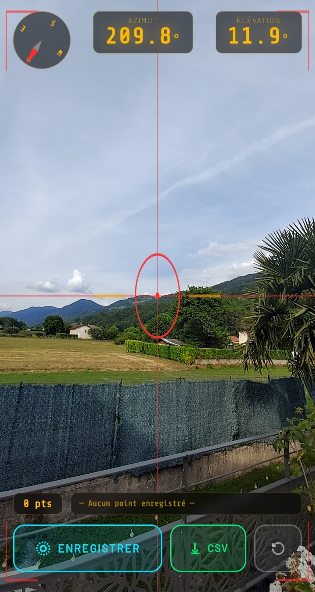

[](LICENSE)
[](https://github.com/38decibel/Solar-Mask-Generator)
[](index.html)

# Solar Mask Generator

**Solar Mask Generator** is a zero-install web app for surveying the solar horizon mask of any location. Point your phone at each obstacle around you, tap to record — export a clean CSV file ready for [Solar Mask](https://github.com/38decibel/solar-mask) or any PV simulation software.

No account. No server. No app store. One HTML file.



## Why

Tools like [Azimutis](https://play.google.com/store/apps/details?id=com.azimutis) are great but limit free measurements. Other options require dedicated hardware or desktop software.

Solar Mask Generator is a free, open-source alternative that runs directly in your browser using your phone's camera, compass, and gyroscope.

## Features

- 📷 **Live camera viewfinder** with crosshair reticle and corner brackets
- 🧭 **Real-time compass** — animated rose with needle, updates live
- 📐 **Azimuth & elevation readout** — degrees, 0.1° precision
- 💾 **One-tap capture** — records the current azimuth/elevation pair
- 📋 **Points review** — view, delete individual points before export
- 📥 **CSV export** — sorted by azimuth, directly compatible with Solar Mask and PVGIS
- 🌗 **Dark tactical UI** — designed for outdoor use in bright sunlight
- 📦 **Single HTML file** — no dependencies, no install, works offline

## Usage

### 1 — Open the app
Go to [Solar Mask Generator](https://38decibel.github.io/Solar-Mask-Generator/) with your smartphone (Android or iOS).

> You can also add it to your home screen for a full-screen, app-like experience:
> - **Android**: Chrome → ⋮ → *Add to Home Screen*
> - **iOS**: Safari → Share → *Add to Home Screen*

### 2 — Grant permissions

Tap **Démarrer**. The app will request:
- **Camera** — for the live viewfinder
- **Motion & Orientation** — for azimuth and elevation (iOS 13+ requires explicit permission)

### 3 — Survey the horizon

Walk around your measurement point (pool edge, terrace, rooftop…) and:

1. Aim the crosshair at the top of each obstacle on the skyline
2. Wait for the readings to stabilise
3. Tap **Enregistrer** to capture the point — a flash confirms the capture
4. Repeat every 10–15° around the full 360°, adding more points where the horizon is complex

> **Tip:** Hold the phone in portrait orientation, as you would to take a photo. The elevation reading is 0° when the phone is perfectly horizontal; positive values mean the obstacle is above the horizon.

### 4 — Export

Tap **CSV** to review your points (sorted by azimuth). Delete any outliers, then tap **⬇ Télécharger CSV** to save the file.

## Output Format

The exported CSV is directly compatible with [Solar Mask](https://github.com/38decibel/Solar-Mask), [PVGIS](https://re.jrc.ec.europa.eu/pvg_tools/en/tools.html), and PVsyst:

```csv
azimuth,elevation
0.0,3.2
15.0,4.8
45.0,12.5
90.0,22.1
135.0,28.4
180.0,18.0
...
350.0,3.5
```

- **azimuth**: compass direction in degrees (0 = North, 90 = East, 180 = South, 270 = West)
- **elevation**: angle above horizontal in degrees

## Compatibility

| Platform | Browser | Camera | Compass | Notes |
|----------|---------|--------|---------|-------|
| Android | Chrome | ✅ | ✅ | No permission prompt needed |
| iOS 13+ | Safari | ✅ | ✅ | Tap *Démarrer* to grant orientation permission |
| iOS 13+ | Chrome | ✅ | ⚠️ | Orientation may be limited in Chrome on iOS |
| Desktop | Any | ✅ | ❌ | Camera works; compass shows 0° (no gyroscope) |

> For best results, use **Chrome on Android** or **Safari on iOS**.

## Tips for Accurate Measurements

- **Calibrate your compass** before starting: wave your phone in a figure-8 pattern a few times to reduce magnetic interference
- **Keep away from metal structures** (fences, railings) when taking readings — they distort the compass
- **Stand exactly at the point you want to measure** — a few metres make a difference for nearby obstacles
- **Aim for the top edge** of each obstacle, not its middle
- **Take more points** in the south quadrant (around 180°) — that's where the sun spends most of its time and where accuracy matters most
- If an obstacle spans a wide azimuth range, capture both its left edge, top, and right edge

## Integration with Solar Mask

Once exported, place your CSV file in `/config/solar_masks/` on your Home Assistant instance and reference it in your `configuration.yaml`:

```yaml
solar_mask:
  - name: pool
    mask_file: /config/solar_masks/pool.csv
```

The Solar Mask integration will automatically pick up the file on the next restart and create all entities for that zone.

For a visual confirmation, the [Solar Mask Card](https://github.com/38decibel/Solar-Mask-Card) will display your measured horizon overlaid with the sun's trajectories.

## Technical Notes

The app uses three standard browser APIs:

- **`getUserMedia`** — camera access (rear-facing, highest available resolution)
- **`DeviceOrientationEvent`** — compass heading and tilt angle
  - iOS: uses `webkitCompassHeading` (true north, auto-calibrated)
  - Android: derives heading from `alpha` rotation axis
- **`Blob` + `URL.createObjectURL`** — client-side CSV download, no server involved

All data stays on your device. Nothing is sent anywhere.

## Limitations

- Compass accuracy depends on your device hardware and local magnetic environment. Typical consumer phone accuracy is ±2–5°, which is sufficient for solar mask purposes.
- The app does not correct for magnetic declination — on most devices, `webkitCompassHeading` (iOS) already uses true north. On Android, accuracy may vary slightly.
- If your browser does not support `DeviceOrientationEvent` (some desktop browsers, some privacy-focused browsers), compass and elevation will read 0°. The camera and CSV export still work.

## Related Projects

| Project | Description |
|---------|-------------|
| [Solar Mask](https://github.com/38decibel/Solar-Mask) | Home Assistant integration — computes sun visibility per zone from a horizon mask |
| [Solar Mask Card](https://github.com/38decibel/solar-Mask-Card) | Lovelace card — visualises sun paths over the horizon mask |

## License

MIT License — see [LICENSE](LICENSE) for details.
